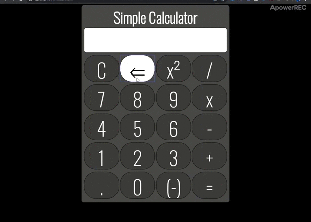

<h1>Calculadora</h1> 
========

Calculadora simples criada em: 
  <ul> 
    <li>HTML</li> 
    <li>CSS</li>
    <li>Javascript</li>
  </ul>

<h2>Como funciona</h2>

Para utilizar a aplicação não é necessaria nenhuma instalação prévia, basta apenas abrir o arquivo index.html.

A calculadora está fazendo apenas uma operação por vez no momento. Fique a vontade para baixer e fazer as melhorias adequadas.

